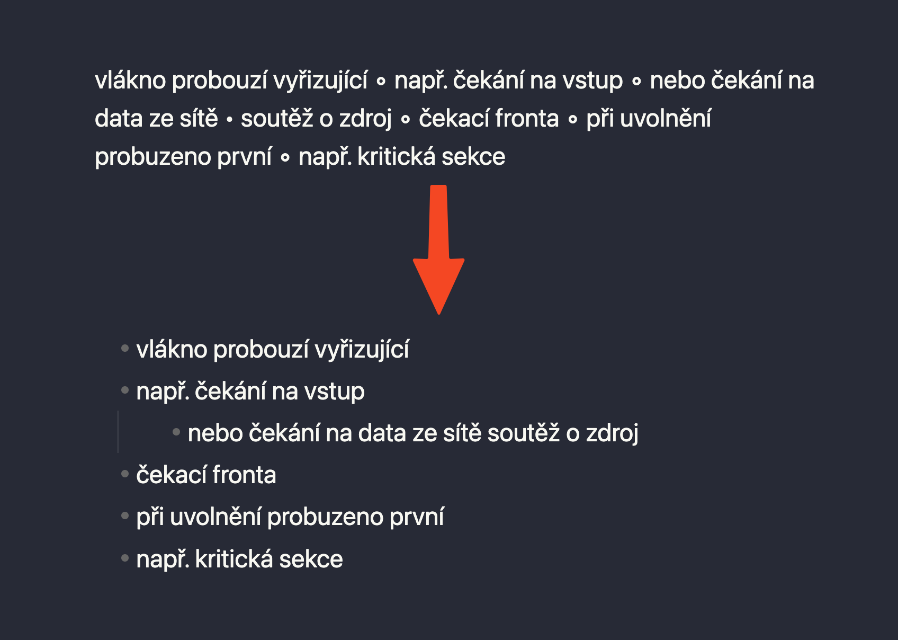

# Convert List Plugin for Obsidian

This plugin is designed for Obsidian users who work with lists in a specific format and need a quick way to convert them into a structured and indented list format. The plugin is particularly useful for handling lists with special characters like '∘' and '•' used as list markers.

## Features

- **Convert List Format**: Converts a selected block of text into a structured list. Lines with '∘' are formatted as list items with one level of indentation, and lines with '•' receive two levels of indentation.

## Usage

1. Select the text block in your Obsidian note that you want to convert.
2. Activate the 'Convert List Format' command.
3. The plugin will automatically reformat the selected text into a structured list with the appropriate indentation.

## Installation

1. Download the code from the GitHub repository.
2. Unzip the release into your `.obsidian/plugins` directory.
3. In Obsidian, go to `Settings` -> `Community Plugins` and ensure Community Plugins are enabled.
4. Browse community plugins and enable the Convert List Plugin.

## Development

This plugin was developed using TypeScript. To modify the plugin, you should have Node.js installed and set up your development environment according to the [Obsidian API documentation](https://obsidian.md/).

## License

This plugin is released under the MIT License. You are free to fork, modify, and use it in your own projects.

## Support and Contributions

If you encounter any issues or have suggestions for improvements, please submit them on the GitHub repository. Contributions to the project are welcome.

## Author

Jakub Andrýsek
https://kubaandrysek.cz/
